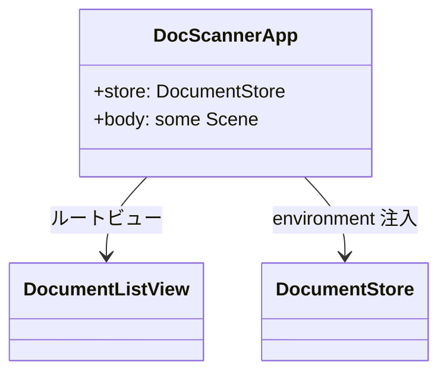
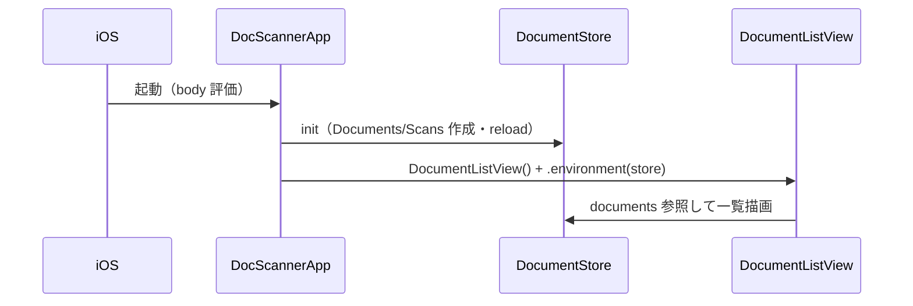

# App フォルダ

アプリのエントリポイントを格納する。

## 型とメソッド一覧

| 型 | メソッド / プロパティ | 役割 |
| --- | --- | --- |
| `DocScannerApp` | `init()` | `DocumentStore` を生成（throws）。失敗時はエラーを保持してエラー画面へ分岐する |
| `DocScannerApp` | `body` | 正常時は `DocumentListView` へ environment 注入、失敗時は「Storage Unavailable」画面 |
| `DocScannerApp` | `store` / `storeError` | アプリ全体共有のストア（初期化失敗時 nil）と保持したエラー |

## クラス図

## シーケンス図

