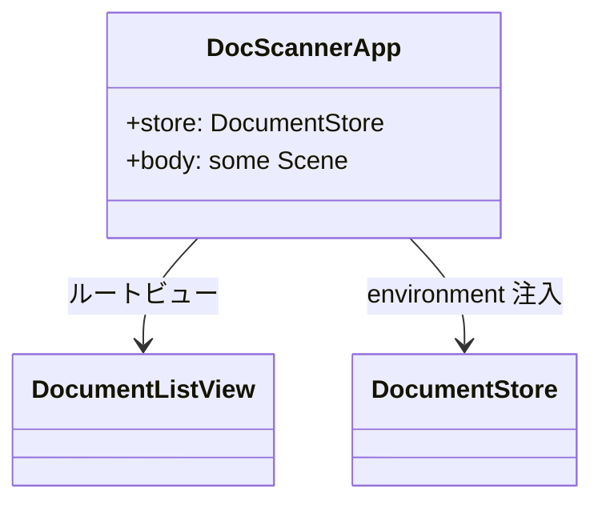
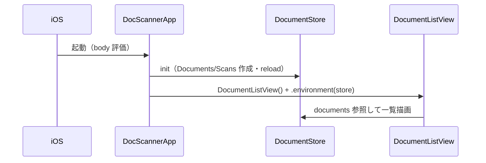

# App フォルダ

アプリのエントリポイントを格納する。

## 型とメソッド一覧

| 型 | メソッド / プロパティ | 役割 |
| --- | --- | --- |
| `DocScannerApp` | `body` | @main の App。`DocumentStore` を生成し `DocumentListView` へ environment 注入する |
| `DocScannerApp` | `store` | アプリ全体共有のドキュメントストア（@State で保持） |

## クラス図

## シーケンス図

