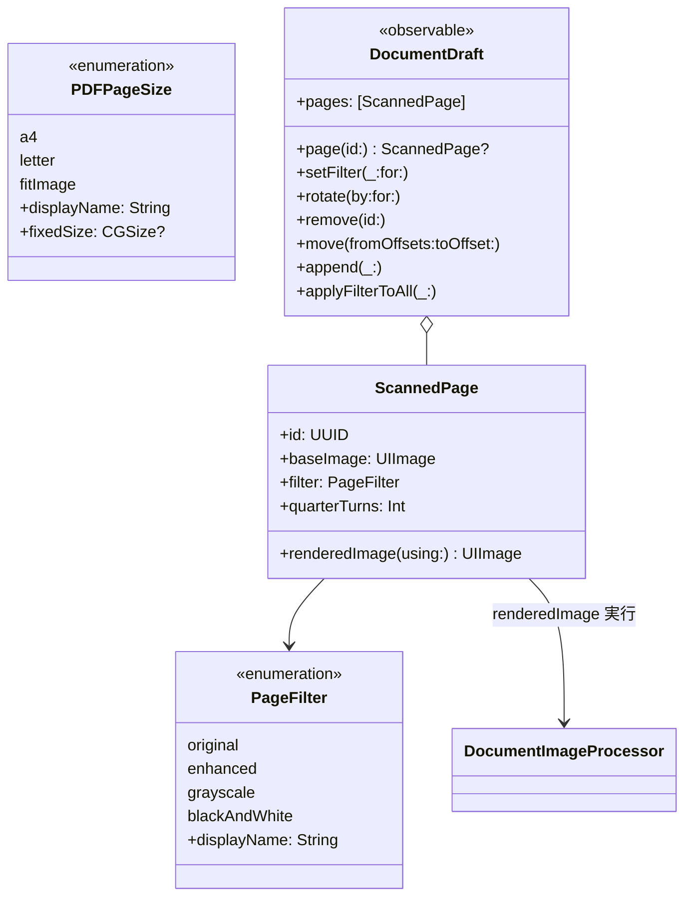
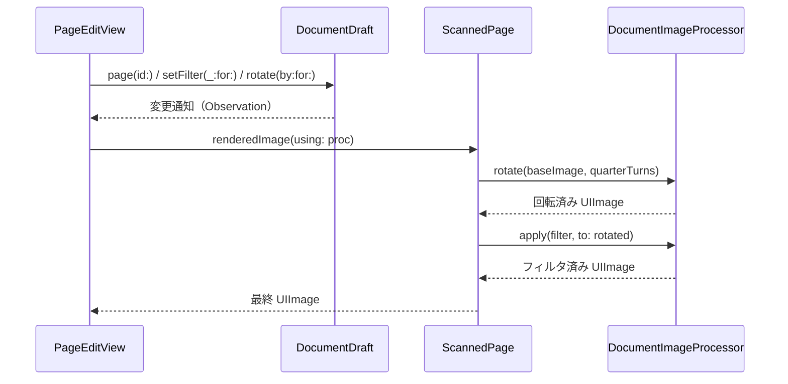

# Model フォルダ

スキャンページ・フィルタ・PDF 用紙サイズのモデル型を格納する。

## 型とメソッド一覧

| 型 | メソッド / プロパティ | 役割 |
| --- | --- | --- |
| `ScannedPage` | `id` / `baseImage` / `filter` / `quarterTurns` | 編集中 1 ページの状態（補正済み元画像・フィルタ・回転数） |
| `ScannedPage` | `init(baseImage:filter:quarterTurns:)` | 新規ページ生成（id 自動採番） |
| `ScannedPage` | `==(lhs:rhs:)` / `hash(into:)` | id ベースの等価・ハッシュ（ナビゲーション用 Hashable） |
| `ScannedPage` | `renderedImage(using:)` | 回転 → フィルタ適用済みの最終画像を返す（throws） |
| `PageFilter` | `original` / `enhanced` / `grayscale` / `blackAndWhite` | フィルタ種別 |
| `PageFilter` | `id` / `displayName` | ForEach 用 id と英語表示名 |
| `PDFPageSize` | `a4` / `letter` / `fitImage` | PDF ページサイズ種別 |
| `PDFPageSize` | `id` / `displayName` / `fixedSize` | ForEach 用 id、表示名、固定 pt サイズ（fitImage は nil） |
| `DocumentDraft` | `pages` | 編集中ページ一覧（@Observable で全ビューが変更を購読） |
| `DocumentDraft` | `init(pages:)` | 下書き初期化 |
| `DocumentDraft` | `page(id:)` | id でページ検索（見つからなければ nil） |
| `DocumentDraft` | `setFilter(_:for:)` / `rotate(by:for:)` | 指定ページのフィルタ/回転更新（未知 id は no-op） |
| `DocumentDraft` | `remove(id:)` / `move(fromOffsets:toOffset:)` / `append(_:)` / `applyFilterToAll(_:)` | 削除・並替・追加・全ページフィルタ |

## クラス図

## シーケンス図

