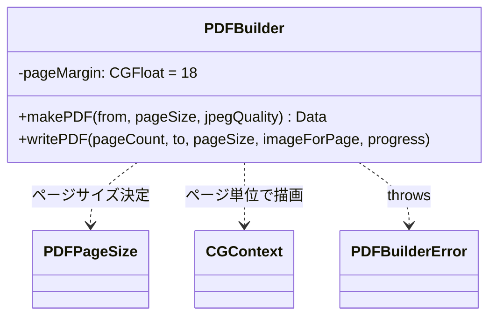
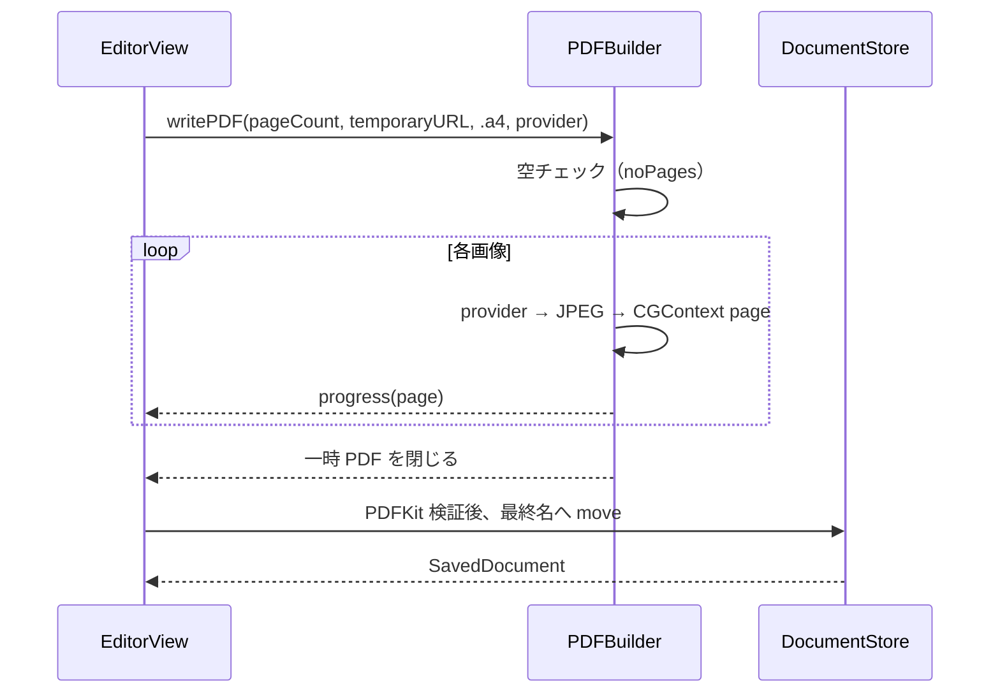

# PDF フォルダ

ページ画像から PDF を生成するビルダーを格納する。

## 型とメソッド一覧

| 型 | メソッド / プロパティ | 役割 |
| --- | --- | --- |
| `PDFBuilderError` | `noPages` / `jpegEncodingFailed` | PDF 生成失敗の LocalizedError |
| `PDFBuilder` | `init()` | ビルダー生成（状態なし） |
| `PDFBuilder` | `makePDF(from:pageSize:jpegQuality:)` | 画像配列 → PDF Data（1 画像 1 ページ、JPEG 再エンコード、throws） |
| `PDFBuilder` | `writePDF(pageCount:to:pageSize:jpegQuality:imageForPage:progress:)` | ページを一枚ずつレンダリングし、一時 PDF ファイルへストリーム出力。失敗・キャンセル時は部分ファイルを削除 |
| `PDFBuilder` | `pageBounds(for:pageSize:)` (private) | ページ境界計算（固定サイズ or 300 DPI のピクセル寸法） |
| `PDFBuilder` | `contentRect(for:in:pageSize:)` (private) | 固定 A4/Letter は aspect-fit・18pt マージン中央配置、`.fitImage` のみページ端まで描画 |

`.fitImage` のページ寸法は、向きを正規化した画像のピクセル寸法を 300 DPI でポイントへ変換（pixel × 72 / 300）して求める。A4/Letter は従来どおり 18pt の余白を維持する。エディタの本番保存はページ単位のストリーム経路を使用し、生成完了・PDF 検証後に Scans 内の一時ファイルから最終名へ移動する。

## クラス図

## シーケンス図

