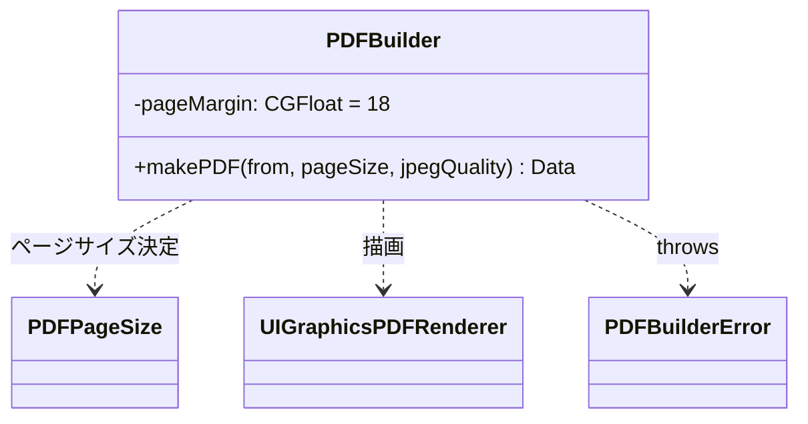
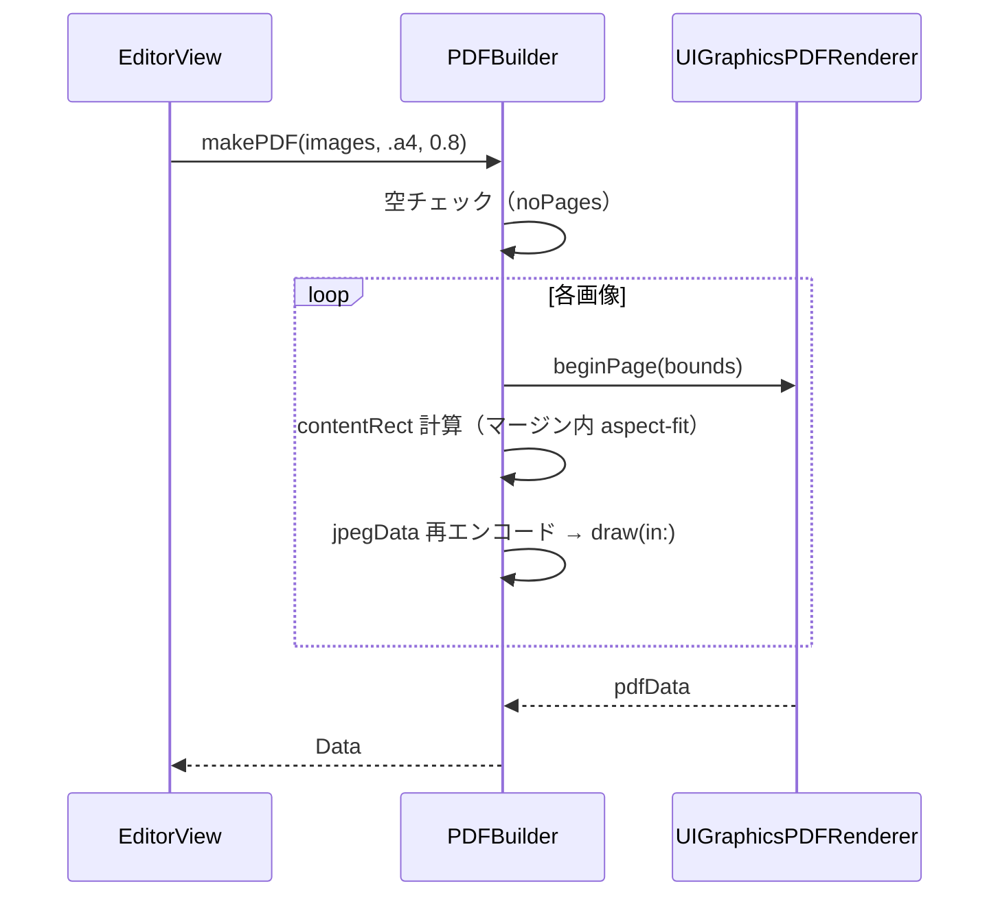

# PDF フォルダ

ページ画像から PDF を生成するビルダーを格納する。

## 型とメソッド一覧

| 型 | メソッド / プロパティ | 役割 |
| --- | --- | --- |
| `PDFBuilderError` | `noPages` / `jpegEncodingFailed` | PDF 生成失敗の LocalizedError |
| `PDFBuilder` | `init()` | ビルダー生成（状態なし） |
| `PDFBuilder` | `makePDF(from:pageSize:jpegQuality:)` | 画像配列 → PDF Data（1 画像 1 ページ、JPEG 再エンコード、throws） |
| `PDFBuilder` | `pageBounds(for:pageSize:)` (private) | ページ境界計算（固定サイズ or 画像サイズ） |
| `PDFBuilder` | `contentRect(for:in:)` (private) | ページ内の描画領域（aspect-fit・18pt マージン中央配置） |

## クラス図

## シーケンス図

