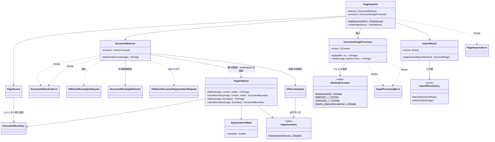
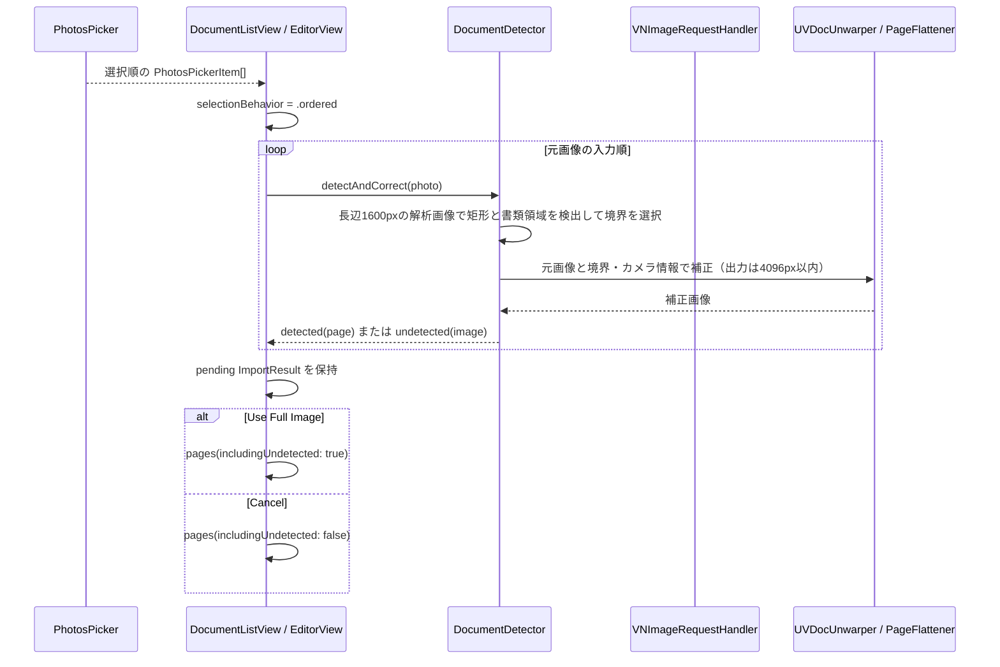

# Processing フォルダ

Core Image / Vision を使った画像処理（フィルタ・回転・書類検出 + 台形補正）を格納する。

## 型とメソッド一覧

| 型 | メソッド / プロパティ | 役割 |
| --- | --- | --- |
| `ImageProcessingError` | `invalidImage` / `filterFailed` / `renderFailed` | 画像処理失敗の LocalizedError |
| `DocumentImageProcessor` | `init()` | CIContext 生成 |
| `DocumentImageProcessor` | `apply(_:to:)` | PageFilter を画像へ適用（陰影除去 + レベル補正、白黒は適応閾値+グローバルランプの min 合成、ピクセルサイズ保持、throws） |
| `DocumentImageProcessor` | `rotate(_:quarterTurns:)` | 90°単位の時計回り回転（mod 4、負値対応、throws） |
| `DocumentImageProcessor` | `downscaled(_:maxPixelDimension:)` | 長辺を上限 px（既定 3000）以下へ縮小（アスペクト保持・scale=1、throws） |
| `DocumentImageProcessor` | `normalizedCGImage(of:)` (private) | UIImage の向きを .up に正規化 |
| `DocumentImageProcessor` | `render(_:scale:)` (private) | CIImage → CGImage → UIImage へ焼き付け |
| `ShadingCorrector` | `background(of:)` (static) | 背景推定（長辺512px縮小→CIMorphologyMaximum r6→CIGaussianBlur r12→復元、throws） |
| `ShadingCorrector` | `flattened(_:)` (static) | CIDivideBlendMode で画像÷背景の平坦化（throws） |
| `ShadingCorrector` | `grayscale(_:)` (static) | 彩度 0 グレースケール化（throws） |
| `ShadingCorrector` | `ramp(_:lo:hi:)` (static) | clamp((x-lo)/(hi-lo)) 線形ランプ（CIColorMatrix→CIColorClamp、throws） |
| `ShadingCorrector` | `levels(_:black:white:gamma:)` (static) | ramp + CIGammaAdjust のレベル補正（throws） |
| `DocumentDetectionError` | `noDocumentFound` / `invalidImage` / `visionFailed` / `correctionFailed` / `renderFailed` / `unexpectedMaskFormat` / `bitmapContextFailed` / `singularHomography` | 検出・フラット化失敗の LocalizedError |
| `DocumentDetector` | `init(unwarper:)` | UVDoc 補正器を保持 |
| `DocumentRectangleDetector` | `makeRequest()` / `preferred(in:)` (static) | 共通設定（信頼度 0.6・最小サイズ 0.1・縦横比 0.15・角度許容 45°・最大 8 候補）で検出し、実面積×信頼度で優先候補を選択。カメラと静止画で共通利用 |
| `DocumentRectangleDetector` | `confirmedDocument(in:document:size:)` (static) | 優先矩形が信頼度 0.8 以上の書類領域と一致する場合だけ返す |
| `DocumentRectangleDetector` | `liveDocument(in:document:size:)` (static) | confidence ≥ 0.6・画像内四隅・凸形状・辺長を検証した書類領域を優先し、領域が無効なら有効な矩形を使用。画面端に近いことだけでは除外しない |
| `DocumentDetector` | `correct(_:boundary:camera:refineBoundary:)` | 保存済み輪郭を必要に応じて近傍だけで調整し、カメラ情報とともに元画像を補正。対象を全画面から再検出しない（throws） |
| `DocumentBoundary` | `init(top:right:bottom:left:)` / `init(corners:)` / `corners` / `outline` / `map(_:)` / `isValid` | 左下原点の正規化四辺。表示・座標変換・補正で共有し、有限性・範囲・凸な四隅を検証 |
| `DocumentDetector` | `detectAndCorrect(_:camera:)` | 長辺1600pxの解析画像で矩形・書類領域を検出し、ライブと同じ候補を選択。候補と一致するマスクから曲線境界を作り、マスクがなければ四隅の境界を使う。元画像をUVDoc、仕様上対象外ならPageFlattenerと文字行補正で処理（throws） |
| `DocumentDetector` | `quadsAgree(_:_:width:height:)` (static) | seg 四角形と優先候補の 4 隅距離が max(W,H)×8% 以内か判定 |
| `DocumentDetector` | `normalizedCGImage(of:)` (private) | UIImage の向きを .up に正規化 |
| `SegmentationMask` | `init(pixelBuffer:imageWidth:imageHeight:)` | Vision Float32 マスクを読み込む（形式不一致は throw） |
| `SegmentationMask` | `init(width:height:values:imageWidth:imageHeight:)` | 合成マスク構築（テスト用） |
| `SegmentationMask` | `value(at:)` | 画像ピクセル座標のマスク値を双線形補間 |
| `PageBitmap` | `init(_:)` | CGImage → sRGB RGBA8 ビットマップ（throws） |
| `PageBitmap` | `luminance(atX:y:)` / `sampleRGB(atX:y:into:)` | 最近傍輝度 / 双線形 RGB サンプル |
| `PageFlattener` | `flatten(_:corners:mask:)` | マスク輪郭追跡 + Coons パッチで湾曲辺を矩形化（throws） |
| `PageFlattener` | `traceBoundary(_:corners:mask:)` / `flatten(_:boundary:camera:)` | 輪郭抽出と補正を分離。ライブ画像から曲線を抽出し、別解像度の写真にも同じ正規化輪郭を使える |
| `PageFlattener` | `refineBoundary(_:boundary:)` | 短辺の±3%以内で明暗方向・持続した段差・辺全体の移動の一貫性を確認し、保存した紙の四辺だけを調整。細い文字線の一過性の段差や周囲と明暗が合わない候補を除外 |
| `DocumentCamera` | `from(data:)` / `oriented(_:)` / `scaled(to:)` | EXIFの35mm換算焦点距離から内部パラメータを近似し、向き・解像度に合わせる。撮影写真の校正データも同じ型で保持 |
| `PagePoint` | `+` / `-` / `*` / `length` | Double 精度 2D 点（左上原点） |
| `PageContentStraightener` | `straighten(_:)` / `render(_:model:rotated:)` | 輪郭補正後に Vision の文字中心点から平面化。横向き写真も解析座標を回転し、出力の向き・サイズは保持 |
| `PageDewarpModel` | `fit(lines:)` / `displacement(at:)` / `sourcePoint(for:)` | 文字行ごとの高さを除去し、x の3次多項式×y の8節点をロバスト回帰。上下端固定、最大変位8%・縦倍率0.5〜1.5・逆写像を検証 |
| `PageGeometry` | `solveLinear(_:_:)` / `homography(from:to:)` / `apply(_:to:)` / `arcLength(_:)` / `sample(_:at:)` (static) | 線形ソルバ・ホモグラフィ・曲線サンプリング（throws） |
| `PageGeometry` | `outputSize(boundary:imageSize:camera:)` | 内部パラメータが使える場合は紙面の方向ベクトルから縦横比を計算。湾曲辺の補正空間での弧長を考慮して画素密度を維持し、比率を保ったまま長辺4096px以内に制限 |
| `PageImporterError` | `loadFailed(index, message)` / `decodeFailed(index)` | 写真読み込み失敗の LocalizedError（index と元エラーメッセージ付き） |
| `ImportResult.Entry` | `detected(ScannedPage)` / `undetected(UIImage)` | 各入力画像の結果を元の選択順に保持 |
| `ImportResult` | `entries` / `detectedPages` / `undetectedImages` / `pages(includingUndetected:)` | 入力順の結果と互換用の分類配列。選択に応じて順序を保ったページ列を再構成 |
| `PageImporter` | `init()` | DocumentDetector と DocumentImageProcessor を生成 |
| `PageImporter` | `loadSources(from:)` (static) | PhotosPickerItem → 画像とカメラ情報を保持したPageSource（失敗は throw、非同期） |
| `PageSource` | `photo(UIImage, camera:)` / `camera(UIImage, boundary:camera:)` / `image` | 写真の自動検出と、シャッター時の固定輪郭を区別。カメラの nil 境界は未検出として確認に回す |
| `PageImporter` | `makePages(from:)`（UIImage / PageSource 配列） | 写真なら縮小画像で検出して元画像を補正、カメラなら固定輪郭を局所調整して元画像を補正。検出済みページは Enhanced 初期選択で ImportResult.entries へ入力順に追加（throws） |

文字行補正は最低6行、横幅45%・高さ25%以上に分布する文字を要求し、行内残差の中央値が30%以上改善する安全なモデルだけを適用する。空白・写真・文字が少ない紙や過大な変形は輪郭補正の結果を保持する。カメラの保存済み輪郭は近傍の同じ辺だけを調整し、対象を再選択しない。文字行補正だけでQRの全辺や大きなロゴの形状まで完全な長方形へ復元する保証はない。

DocRes / UVDoc の実際のモデル読み込み・予測・出力検証・描画失敗は、詳細を private として記録し、処理エラーとして呼び出し元へ返す。入力が小さい、極端な縦横比、または低コントラストの場合だけ、明示的な selection として従来補正を使う。Vision の文字検出エラーもログ後に伝播し、文字量が足りない場合のみ選択として元の補正結果を保持する。全処理は共有 sRGB `ImageRendering.context` を使う。

## クラス図

## シーケンス図

