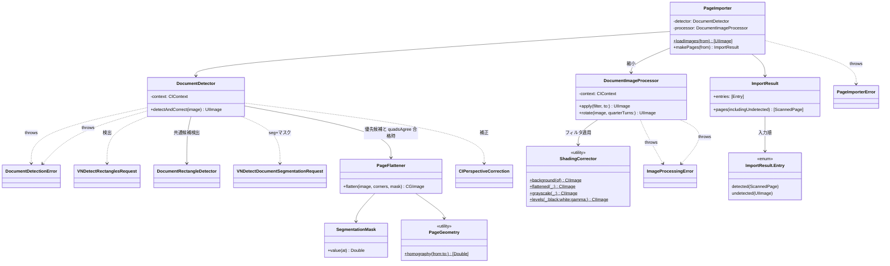
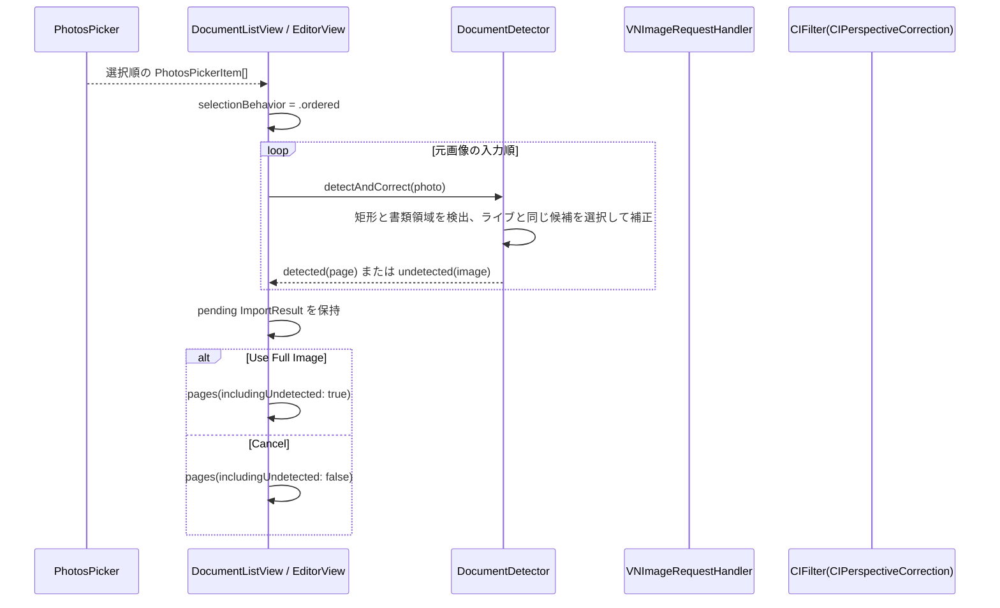

# Processing フォルダ

Core Image / Vision を使った画像処理（フィルタ・回転・書類検出 + 台形補正）を格納する。

## 型とメソッド一覧

| 型 | メソッド / プロパティ | 役割 |
| --- | --- | --- |
| `ImageProcessingError` | `invalidImage` / `filterFailed` / `renderFailed` | 画像処理失敗の LocalizedError |
| `DocumentImageProcessor` | `init()` | CIContext 生成 |
| `DocumentImageProcessor` | `apply(_:to:)` | PageFilter を画像へ適用（陰影除去 + レベル補正、白黒は適応閾値+グローバルランプの min 合成、ピクセルサイズ保持、throws） |
| `DocumentImageProcessor` | `rotate(_:quarterTurns:)` | 90°単位の時計回り回転（mod 4、負値対応、throws） |
| `DocumentImageProcessor` | `downscaled(_:maxPixelDimension:)` | 長辺を上限 px（既定 3000）以下へ縮小（アスペクト保持・scale=1、throws） |
| `DocumentImageProcessor` | `normalizedCGImage(of:)` (private) | UIImage の向きを .up に正規化 |
| `DocumentImageProcessor` | `render(_:scale:)` (private) | CIImage → CGImage → UIImage へ焼き付け |
| `ShadingCorrector` | `background(of:)` (static) | 背景推定（長辺512px縮小→CIMorphologyMaximum r6→CIGaussianBlur r12→復元、throws） |
| `ShadingCorrector` | `flattened(_:)` (static) | CIDivideBlendMode で画像÷背景の平坦化（throws） |
| `ShadingCorrector` | `grayscale(_:)` (static) | 彩度 0 グレースケール化（throws） |
| `ShadingCorrector` | `ramp(_:lo:hi:)` (static) | clamp((x-lo)/(hi-lo)) 線形ランプ（CIColorMatrix→CIColorClamp、throws） |
| `ShadingCorrector` | `levels(_:black:white:gamma:)` (static) | ramp + CIGammaAdjust のレベル補正（throws） |
| `DocumentDetectionError` | `noDocumentFound` / `invalidImage` / `visionFailed` / `correctionFailed` / `renderFailed` / `unexpectedMaskFormat` / `bitmapContextFailed` / `singularHomography` | 検出・フラット化失敗の LocalizedError |
| `DocumentDetector` | `init()` | CIContext 生成 |
| `DocumentRectangleDetector` | `makeRequest()` / `preferred(in:)` (static) | 共通設定（信頼度 0.6・最小サイズ 0.1・縦横比 0.15・角度許容 45°・最大 8 候補）で検出し、実面積×信頼度で優先候補を選択。カメラと静止画で共通利用 |
| `DocumentRectangleDetector` | `confirmedDocument(in:document:size:)` (static) | 優先矩形が信頼度 0.8 以上の書類領域と一致する場合だけ返す |
| `DocumentRectangleDetector` | `liveDocument(in:document:size:)` (static) | 一致矩形、または信頼度・画像内四隅・凸形状・辺長を検証した書類領域を返す。ライブと静止画の共通選択規則 |
| `DocumentDetector` | `detectAndCorrect(_:)` | 矩形・書類領域を両方検出し、ライブと同じ書類候補を優先。書類候補がない場合は矩形を使用。選択候補と seg が一致しマスクがあれば PageFlattener、なければ CIPerspectiveCorrection（throws） |
| `DocumentDetector` | `quadsAgree(_:_:width:height:)` (static) | seg 四角形と優先候補の 4 隅距離が max(W,H)×8% 以内か判定 |
| `DocumentDetector` | `perspectiveCorrect(_:rectangle:scale:)` (private) | CIPerspectiveCorrection 適用 + レンダリング |
| `DocumentDetector` | `normalizedCGImage(of:)` (private) | UIImage の向きを .up に正規化 |
| `SegmentationMask` | `init(pixelBuffer:imageWidth:imageHeight:)` | Vision Float32 マスクを読み込む（形式不一致は throw） |
| `SegmentationMask` | `init(width:height:values:imageWidth:imageHeight:)` | 合成マスク構築（テスト用） |
| `SegmentationMask` | `value(at:)` | 画像ピクセル座標のマスク値を双線形補間 |
| `PageBitmap` | `init(_:)` | CGImage → sRGB RGBA8 ビットマップ（throws） |
| `PageBitmap` | `luminance(atX:y:)` / `sampleRGB(atX:y:into:)` | 最近傍輝度 / 双線形 RGB サンプル |
| `PageFlattener` | `flatten(_:corners:mask:)` | マスク輪郭追跡 + Coons パッチで湾曲辺を矩形化（throws） |
| `PagePoint` | `+` / `-` / `*` / `length` | Double 精度 2D 点（左上原点） |
| `PageGeometry` | `solveLinear(_:_:)` / `homography(from:to:)` / `apply(_:to:)` / `arcLength(_:)` / `sample(_:at:)` (static) | 線形ソルバ・ホモグラフィ・曲線サンプリング（throws） |
| `PageImporterError` | `loadFailed(index, message)` / `decodeFailed(index)` | 写真読み込み失敗の LocalizedError（index と元エラーメッセージ付き） |
| `ImportResult.Entry` | `detected(ScannedPage)` / `undetected(UIImage)` | 各入力画像の結果を元の選択順に保持 |
| `ImportResult` | `entries` / `detectedPages` / `undetectedImages` / `pages(includingUndetected:)` | 入力順の結果と互換用の分類配列。選択に応じて順序を保ったページ列を再構成 |
| `PageImporter` | `init()` | DocumentDetector と DocumentImageProcessor を生成 |
| `PageImporter` | `loadImages(from:)` (static) | PhotosPickerItem → UIImage（失敗は throw、非同期） |
| `PageImporter` | `makePages(from:)` | 縮小 → 検出を入力順に実行し ImportResult.entries へ追加（throws） |

## クラス図

## シーケンス図

