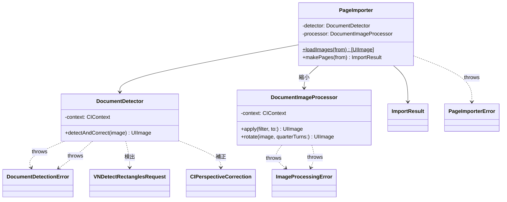
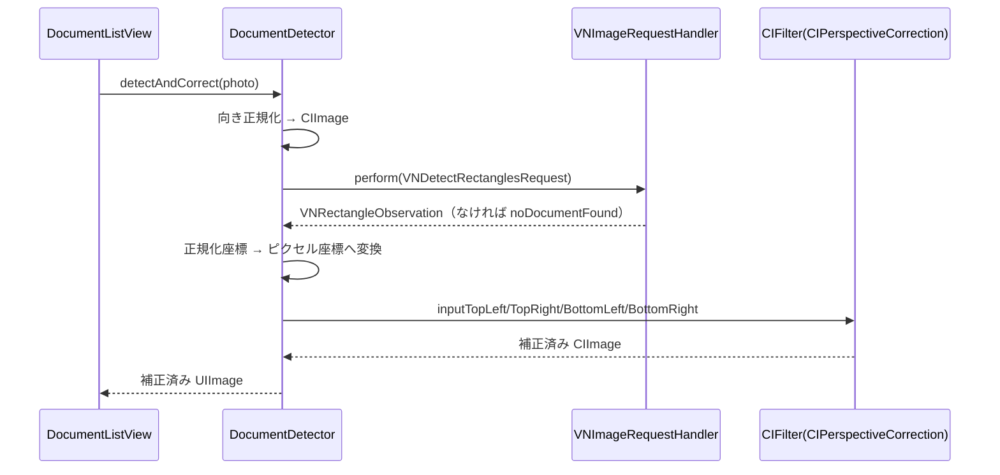

# Processing フォルダ

Core Image / Vision を使った画像処理（フィルタ・回転・書類検出 + 台形補正）を格納する。

## 型とメソッド一覧

| 型 | メソッド / プロパティ | 役割 |
| --- | --- | --- |
| `ImageProcessingError` | `invalidImage` / `filterFailed` / `renderFailed` | 画像処理失敗の LocalizedError |
| `DocumentImageProcessor` | `init()` | CIContext 生成 |
| `DocumentImageProcessor` | `apply(_:to:)` | PageFilter を画像へ適用（ピクセルサイズ保持、throws） |
| `DocumentImageProcessor` | `rotate(_:quarterTurns:)` | 90°単位の時計回り回転（mod 4、負値対応、throws） |
| `DocumentImageProcessor` | `downscaled(_:maxPixelDimension:)` | 長辺を上限 px（既定 3000）以下へ縮小（アスペクト保持・scale=1、throws） |
| `DocumentImageProcessor` | `normalizedCGImage(of:)` (private) | UIImage の向きを .up に正規化 |
| `DocumentImageProcessor` | `grayscaleFilter(for:)` (private) | 彩度 0 の CIColorControls 出力 |
| `DocumentImageProcessor` | `render(_:scale:)` (private) | CIImage → CGImage → UIImage へ焼き付け |
| `DocumentDetectionError` | `noDocumentFound` / `invalidImage` / `visionFailed` / `correctionFailed` / `renderFailed` | 検出失敗の LocalizedError |
| `DocumentDetector` | `init()` | CIContext 生成 |
| `DocumentDetector` | `detectAndCorrect(_:)` | VNDetectRectanglesRequest + CIPerspectiveCorrection で台形補正（throws） |
| `DocumentDetector` | `normalizedCGImage(of:)` (private) | UIImage の向きを .up に正規化 |
| `PageImporterError` | `loadFailed(index, message)` / `decodeFailed(index)` | 写真読み込み失敗の LocalizedError（index と元エラーメッセージ付き） |
| `ImportResult` | `detectedPages` / `undetectedImages` | 検出済みページと未検出元画像の振り分け結果 |
| `PageImporter` | `init()` | DocumentDetector と DocumentImageProcessor を生成 |
| `PageImporter` | `loadImages(from:)` (static) | PhotosPickerItem → UIImage（失敗は throw、非同期） |
| `PageImporter` | `makePages(from:)` | 縮小 → 検出を実行し ImportResult を返す（throws） |

## クラス図

## シーケンス図

