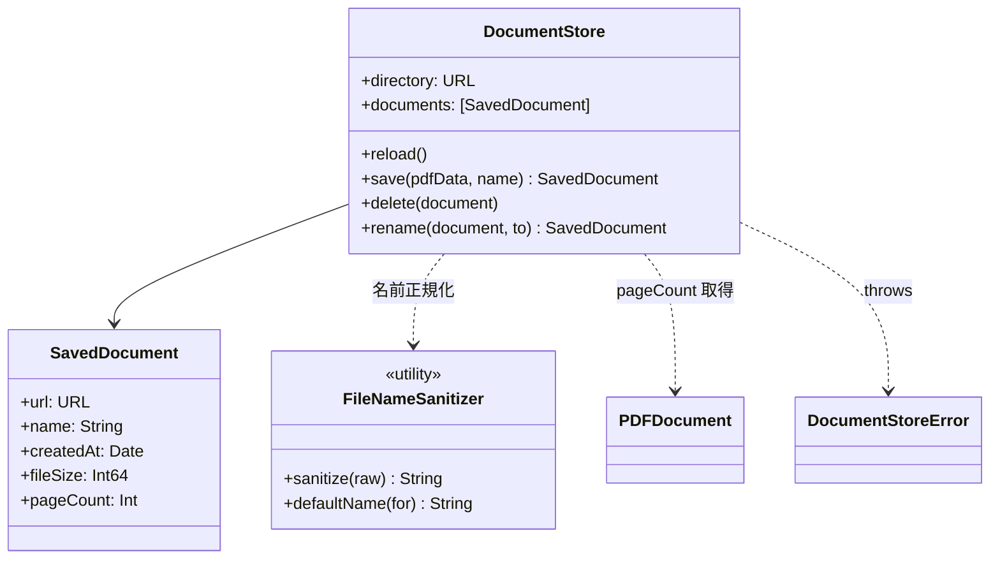
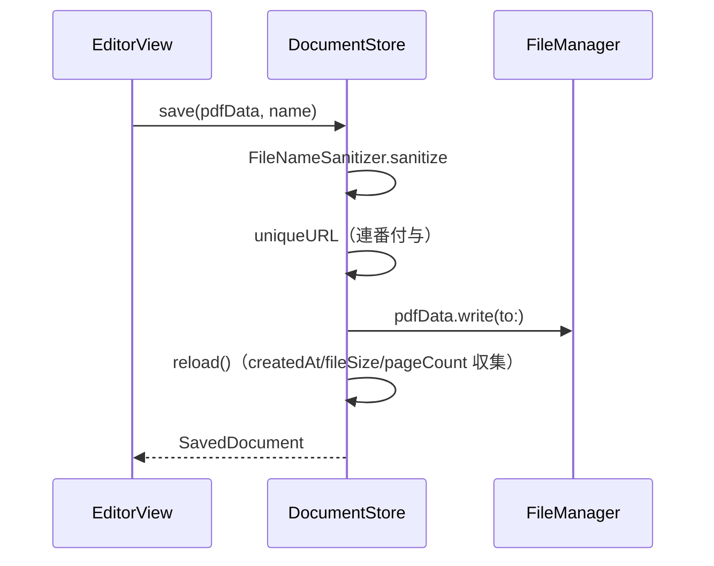

# Storage フォルダ

PDF ファイル名のサニタイズと保存ディレクトリ管理を格納する。

## 型とメソッド一覧

| 型 | メソッド / プロパティ | 役割 |
| --- | --- | --- |
| `FileNameError` | `empty` | ファイル名不正の LocalizedError |
| `DocumentStoreError` | `unreadableDocument` / `missingFileAttributes` | 読めない PDF・属性欠損の LocalizedError |
| `FileNameSanitizer` | `sanitize(_:)` (static) | 不正文字置換・末尾 .pdf 除去・空チェック（throws） |
| `FileNameSanitizer` | `defaultName(for:)` (static) | "Scan yyyy-MM-dd HH.mm.ss" 形式の既定名 |
| `SavedDocument` | `url` / `name` / `createdAt` / `fileSize` / `pageCount` | 保存済み PDF のメタ情報（Identifiable, Hashable） |
| `DocumentStore` | `directory` / `documents` | 保存先 URL と一覧（新しい順、@Observable） |
| `DocumentStore` | `init(directory:)` | ディレクトリ作成 + 初回 reload（throws、テスト用に注入可能） |
| `DocumentStore` | `reload()` | *.pdf 列挙しメタ情報付きで一覧再構築（throws。属性欠損→missingFileAttributes、読めない PDF→unreadableDocument） |
| `DocumentStore` | `save(pdfData:name:)` | ユニーク名（"Name (2)" 等）で保存し SavedDocument を返す（throws） |
| `DocumentStore` | `delete(_:)` | ファイル削除 + reload（throws） |
| `DocumentStore` | `rename(_:to:)` | ユニーク名へ移動 + reload（throws） |
| `DocumentStore` | `uniqueURL(for:excluding:)` (private) | 重複しない "Base (n).pdf" URL を決定 |

## クラス図

## シーケンス図

