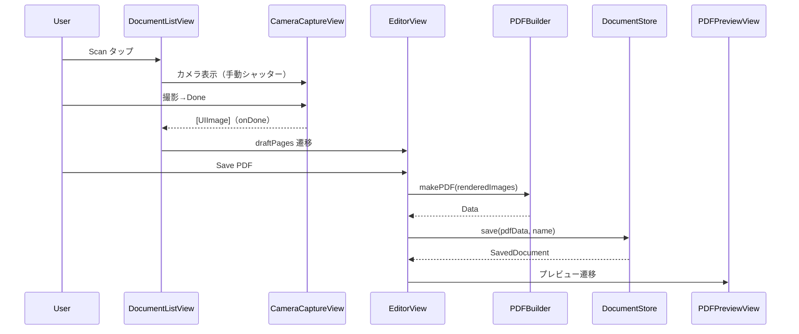

# Views フォルダ

SwiftUI 画面群を格納する。

## 型とメソッド一覧

| 型 | メソッド / プロパティ | 役割 |
| --- | --- | --- |
| `DocumentListView` | `body` | 保存 PDF 一覧ルート。Scan（カメラ非搭載時アラート）/ Import（PhotosPicker→書類検出）、スワイプ削除、コンテキストメニュー（Rename/Share/Delete）。Scan/Import は `.safeAreaInset(edge: .bottom)` のフル幅ボタン（iOS 26 の `.bottomBar` ツールバーでは `.titleAndIcon` が効かないため） |
| `DocumentListView` | `importItems` / `handleImages` / `acceptUndetectedImages` / `discardUndetectedImages` / `delete` / `performRename` / `present` (private) | 順序付き写真・カメラ取り込み（pending ImportResult と独立した alert Bool を保持）、未検出確認、削除、リネーム、エラー表示 |
| `DocumentRow` (private) | `body` / `metaText` / `loadThumbnail` | 1 行表示（PDFKit 1 ページ目サムネイル + 日時・ページ数・サイズ） |
| `CameraError` | `noCameraDevice` / `cannotCreateInput` / `cannotAddInput` / `cannotAddPhotoOutput` / `cannotAddVideoOutput` / `captureFailed` / `invalidPhotoData` | カメラ構成・撮影失敗の LocalizedError |
| `CameraController` | `isAvailable()` (static) / `beginActivation()` / `start(generation:)` / `stop()` / `capture()` | @Observable な AVCaptureSession ラッパー。sessionQueue で configure+start/stop を直列化し、世代トークンで遅延開始・UI 通知を抑止。写真 pending は MainActor で同期設定し、最終 callback まで単一撮影を維持 |
| `CameraController` | `detectedQuad` / `frameSize` / `captures` / `lastCapture` / `isCapturing` / `canFinish` / `error` / `isConfigured` / `captureSession` | UI 公開状態。撮影中はシャッター/Done を無効化し、Done は画像ありかつ pending なしの場合のみ有効 |
| `CameraCaptureView` | `body` / `startIfAuthorized` (async) | フルスクリーンカメラ画面。preview（aspectFill）+ 緑 quad オーバレイ + 手動シャッター（白フラッシュ）+ 枚数/サムネイル + Done/Cancel。SwiftUI task が権限要求を所有し、denied は Open Settings、撮影失敗は pending 解除後も画面を保つエラーアラート |
| `CameraCaptureView` | `overlayPoints(normalized:bufferSize:viewSize:)` (static) | Vision y-up 正規化座標 → aspect-fill ビュー座標変換（単体テスト対象） |
| `CameraPreviewView` (private) | `makeUIView` / `updateUIView` | AVCaptureVideoPreviewLayer の Representable。緑枠と同一の全画面 GeometryReader を共有（resizeAspectFill）。isConfigured 更新後にも接続回転を設定 |
| `CameraPreviewView.PreviewView` (private) | `updateRotation()` | 接続が利用可能なら解析フレームと同じ rotation 90 を適用 |
| `EditorView` | `body` / `init(pages:)` | 新規ドキュメント編集（List .onMove 並べ替え・削除、ファイル名、用紙サイズ、追加スキャン/インポート、全ページフィルタ、Save PDF は下部 safeAreaInset のフル幅ボタン）。ページは共有 `DocumentDraft` で保持し、行タップ→ `editingPageID` → `.navigationDestination(item:)` で遷移（item/値ベース遷移の混在は不可） |
| `EditorView` | `importItems` / `handleImages` / `save` / `applyFilterToAll` / `showCameraOrAlert` / `acceptUndetected` / `discardUndetected` (private) | 順序付き pending ImportResult から既存ページの後ろへ取込・保存 |
| `PageRow` (private) | `body` / `loadThumbnail` / `thumbnailKey` | ページ縮小サムネイル行（失敗時は警告アイコン）。draft+pageID で参照し Filter All の変更も Observation で反映、非同期完了時にキーが変わっていれば古い結果を破棄。行は Button+chevron で包み `.onMove`/`.onDelete` は維持 |
| `PageEditView` | `body` / `init(draft:pageID:)` / `editContent` / `filterSelection` / `renderPage` / `renderKey` | 1 ページ編集（大プレビュー、フィルタ segmented、左右回転、削除）。ページは draft から id で読み、編集は draft メソッドへ委譲。非同期レンダリング完了時に renderKey が変わっていれば古い結果を捨てる |
| `PDFKitView` (private) | `makeUIView` / `updateUIView` | PDFKit PDFView の Representable |
| `PDFPreviewView` | `body` / `deleteDocument` | 保存済み PDF プレビュー + ShareLink + Delete |

## クラス図

```mermaid
classDiagram
    class DocumentListView
    class CameraCaptureView {
        +onDone([UIImage])
        +onError(Error)
        +onCancel()
        +overlayPoints(normalized, bufferSize, viewSize)$ [CGPoint]
    }
    class CameraController {
        <<observable>>
        +detectedQuad: [CGPoint]
        +captures: [UIImage]
        +beginActivation() UInt64
        +start(generation) / stop() / capture()
        +isCapturing / canFinish
    }
    class CameraLifecycleState {
        +activate() UInt64
        +deactivate()
        +canStart(generation, taskIsCancelled) Bool
    }
    class CameraPhotoState {
        +beginCapture() Bool
        +finishCapture(image, shouldAppend)
        +canFinish Bool
    }
    class EditorView {
        +draft: DocumentDraft
    }
    class PageEditView {
        +draft: DocumentDraft
        +pageID: UUID
    }
    class PDFPreviewView {
        +document: SavedDocument
    }
    DocumentListView --> CameraCaptureView : Scan 起動
    CameraCaptureView --> CameraController : セッション・撮影
    CameraController --> DocumentRectangleDetector : 最大8候補から面積×信頼度で選択
    CameraController --> CameraLifecycleState : 世代ガード
    CameraController --> CameraPhotoState : single-flight 撮影状態
    DocumentListView --> EditorView : スキャン/インポート後
    DocumentListView --> PDFPreviewView : 保存済み選択
    EditorView --> PageEditView : editingPageID→navigationDestination(item:)
    EditorView --> PDFPreviewView : 保存完了
    EditorView --> CameraCaptureView : Add Pages
```

## シーケンス図


