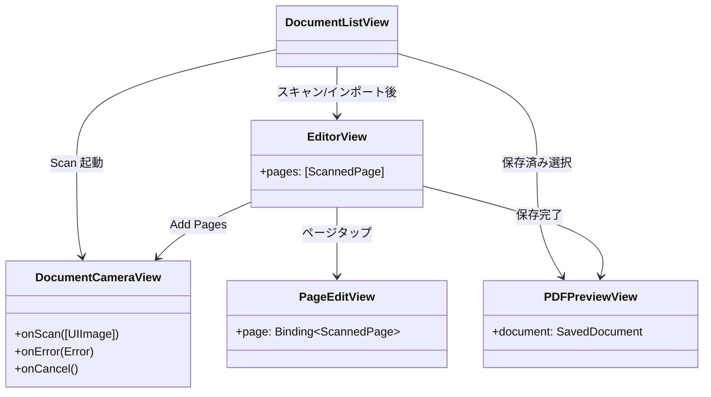
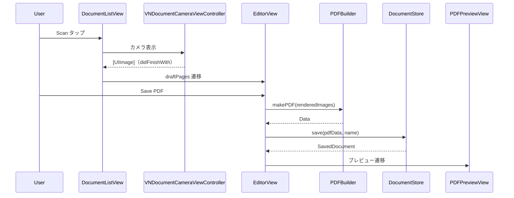

# Views フォルダ

SwiftUI 画面群を格納する。

## 型とメソッド一覧

| 型 | メソッド / プロパティ | 役割 |
| --- | --- | --- |
| `DocumentListView` | `body` | 保存 PDF 一覧ルート。Scan（VNDocumentCamera 非対応時アラート）/ Import（PhotosPicker→書類検出）、スワイプ削除、コンテキストメニュー（Rename/Share/Delete）。Scan/Import は `.safeAreaInset(edge: .bottom)` のフル幅ボタン（iOS 26 の `.bottomBar` ツールバーでは `.titleAndIcon` が効かないため） |
| `DocumentListView` | `importItems` / `acceptUndetectedImages` / `discardUndetectedImages` / `delete` / `performRename` / `present` (private) | 写真取り込み（未検出は「Use Full Image / Cancel」確認）、削除、リネーム、エラー表示 |
| `DocumentRow` (private) | `body` / `metaText` / `loadThumbnail` | 1 行表示（PDFKit 1 ページ目サムネイル + 日時・ページ数・サイズ） |
| `DocumentCameraView` | `makeUIViewController` / `updateUIViewController` / `makeCoordinator` | VNDocumentCameraViewController の Representable |
| `DocumentCameraView.Coordinator` | `didFinishWith` / `didCancel` / `didFailWithError` | スキャン結果→[UIImage]、キャンセル、エラーの delegate 実装 |
| `EditorView` | `body` / `init(pages:)` | 新規ドキュメント編集（List .onMove 並べ替え・削除、ファイル名、用紙サイズ、追加スキャン/インポート、全ページフィルタ、Save PDF は下部 safeAreaInset のフル幅ボタン） |
| `EditorView` | `update` / `remove` / `importItems` / `save` / `applyFilterToAll` (private) | ページ操作・保存処理（編集結果は `update` で id 差し替え、削除済みは no-op） |
| `PageRow` (private) | `body` / `loadThumbnail` | ページ縮小サムネイル行（失敗時は警告アイコン） |
| `PageEditView` | `body` / `init(page:onChange:onDelete:)` / `renderPage` / `renderKey` | 1 ページ編集（大プレビュー、フィルタ segmented、左右回転、削除）。ページはローカル @State で保持し `.onChange(of: renderKey)` で親へ通知（カスタム Binding では body 再評価されずプレビューが更新されないため） |
| `PDFKitView` (private) | `makeUIView` / `updateUIView` | PDFKit PDFView の Representable |
| `PDFPreviewView` | `body` / `deleteDocument` | 保存済み PDF プレビュー + ShareLink + Delete |

## クラス図

## シーケンス図

