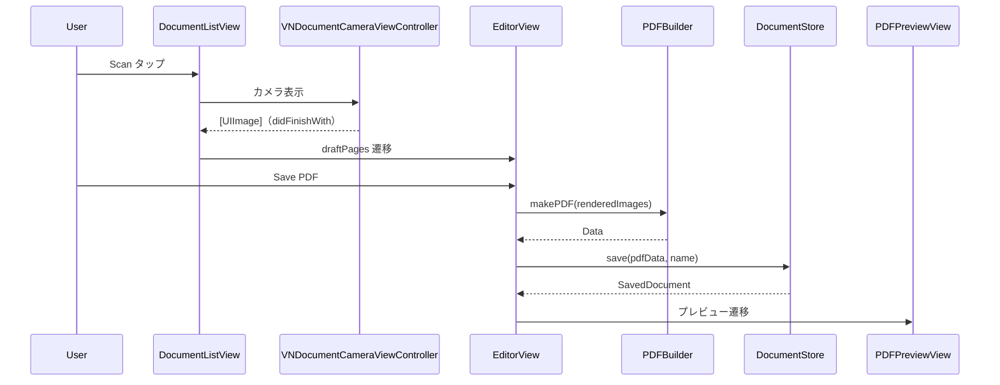

# Views フォルダ

SwiftUI 画面群を格納する。

## 型とメソッド一覧

| 型 | メソッド / プロパティ | 役割 |
| --- | --- | --- |
| `DocumentListView` | `body` | 保存 PDF 一覧ルート。Scan（VNDocumentCamera 非対応時アラート）/ Import（PhotosPicker→書類検出）、スワイプ削除、コンテキストメニュー（Rename/Share/Delete）。Scan/Import は `.safeAreaInset(edge: .bottom)` のフル幅ボタン（iOS 26 の `.bottomBar` ツールバーでは `.titleAndIcon` が効かないため） |
| `DocumentListView` | `importItems` / `acceptUndetectedImages` / `discardUndetectedImages` / `delete` / `performRename` / `present` (private) | 写真取り込み（未検出は「Use Full Image / Cancel」確認）、削除、リネーム、エラー表示 |
| `DocumentRow` (private) | `body` / `metaText` / `loadThumbnail` | 1 行表示（PDFKit 1 ページ目サムネイル + 日時・ページ数・サイズ） |
| `DocumentCameraView` | `makeUIViewController` / `updateUIViewController` / `makeCoordinator` | VNDocumentCameraViewController の Representable |
| `DocumentCameraView.Coordinator` | `didFinishWith` / `didCancel` / `didFailWithError` | スキャン結果→[UIImage]、キャンセル、エラーの delegate 実装 |
| `EditorView` | `body` / `init(pages:)` | 新規ドキュメント編集（List .onMove 並べ替え・削除、ファイル名、用紙サイズ、追加スキャン/インポート、全ページフィルタ、Save PDF は下部 safeAreaInset のフル幅ボタン）。ページは共有 `DocumentDraft` で保持し、行タップ→ `editingPageID` → `.navigationDestination(item:)` で遷移（item/値ベース遷移の混在は不可） |
| `EditorView` | `importItems` / `save` / `applyFilterToAll` / `showCameraOrAlert` / `acceptUndetected` / `discardUndetected` (private) | ページ取込・保存処理 |
| `PageRow` (private) | `body` / `loadThumbnail` / `thumbnailKey` | ページ縮小サムネイル行（失敗時は警告アイコン）。draft+pageID で参照し Filter All の変更も Observation で反映、非同期完了時にキーが変わっていれば古い結果を破棄。行は Button+chevron で包み `.onMove`/`.onDelete` は維持 |
| `PageEditView` | `body` / `init(draft:pageID:)` / `editContent` / `filterSelection` / `renderPage` / `renderKey` | 1 ページ編集（大プレビュー、フィルタ segmented、左右回転、削除）。ページは draft から id で読み、編集は draft メソッドへ委譲。非同期レンダリング完了時に renderKey が変わっていれば古い結果を捨てる |
| `PDFKitView` (private) | `makeUIView` / `updateUIView` | PDFKit PDFView の Representable |
| `PDFPreviewView` | `body` / `deleteDocument` | 保存済み PDF プレビュー + ShareLink + Delete |

## クラス図

```mermaid
classDiagram
    class DocumentListView
    class DocumentCameraView {
        +onScan([UIImage])
        +onError(Error)
        +onCancel()
    }
    class EditorView {
        +draft: DocumentDraft
    }
    class PageEditView {
        +draft: DocumentDraft
        +pageID: UUID
    }
    class PDFPreviewView {
        +document: SavedDocument
    }
    DocumentListView --> DocumentCameraView : Scan 起動
    DocumentListView --> EditorView : スキャン/インポート後
    DocumentListView --> PDFPreviewView : 保存済み選択
    EditorView --> PageEditView : editingPageID→navigationDestination(item:)
    EditorView --> PDFPreviewView : 保存完了
    EditorView --> DocumentCameraView : Add Pages
```

## シーケンス図


