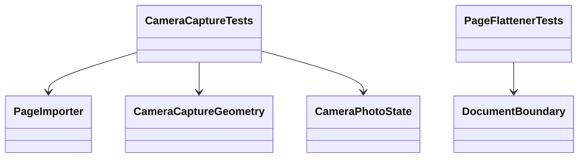
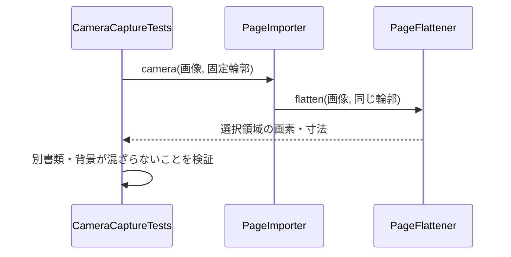
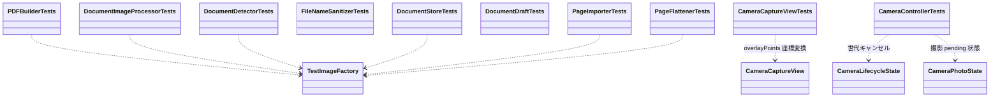
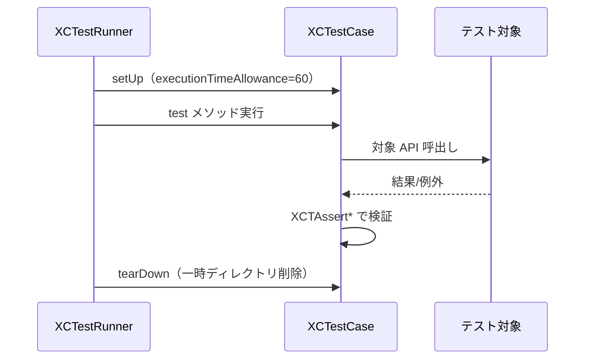

# DocScannerTests フォルダ

ユニットテスト（XCTest、`@testable import DocScanner`、TEST_HOST はアプリ本体）。

## ヘルパー

| 型 | メソッド | 役割 |
| --- | --- | --- |
| `TestImageFactory` | `solid(_:size:)` | 単色 UIImage 生成（scale=1） |
| `TestImageFactory` | `gradient(size:)` | 水平グレーグラデーション生成 |
| `TestImageFactory` | `markedSkewedDocument()` | 暗背景＋歪んだ白い紙＋左上角の黒マーカー（上下区別用）生成 |
| `TestImageFactory` | `pixelColor(of:x:y:)` | 指定ピクセルの色取得（アルファ有無両対応） |
| `TestImageFactory` | `pixelSize(of:)` | ピクセル単位サイズ取得 |

## テストケース一覧

### CameraCaptureTests

| テスト | 内容 |
| --- | --- |
| `testCameraImportKeepsSelectedRegionInsteadOfRedetecting` | 大きい別書類があっても保存した小さい赤い領域だけを補正 |
| `testCameraWithoutOverlayRequiresFullImageConfirmation` | 枠なし撮影は未検出として全文画像の確認へ回す |
| `testRotatedPhotoUsesUprightBoundary` | EXIF右回転写真でも同じ選択範囲と出力寸法を保持 |
| `testHighResolutionCapturePreservesNormalizedSelection` | 4200px画像を3000pxへ縮小しても正規化選択領域を保持 |
| `testPhotoStateKeepsEachCaptureBoundaryAndSkipsFailure` | ページごとの固定輪郭、撮影順、失敗時の非追加 |
| `testDifferentVideoAndPhotoFieldsOfView` | video→metadata→photoの異なる画角を模したアフィン変換 |
| `testAllPhotoOrientations` | 8種類のEXIF向きの座標変換 |
| `testInvalidSavedBoundaryIsRejected` | 不正な保存輪郭を再検出で隠さずエラーにする |

### 保存輪郭・湾曲候補の追加回帰

| テスト | 内容 |
| --- | --- |
| `PageFlattenerTests.testSavedCurvedBoundaryIsReusedAtPhotoResolution` | 低解像度で抽出した曲線を2倍の写真へ再利用し、紙の上辺に背景が残らない |
| `DocumentRectangleTrackerTests.testCurvedCornerJitterAcquiresWithoutSwitchingToOtherPaper` | 湾曲紙の角の5.5%揺れを許容しつつ別候補へ飛ばない |
| `DocumentRectangleTrackerTests.testModerateConfidenceCurvedDocumentStillRequiresStability` | confidence 0.65の安定候補を採用、0.4は拒否 |
| `DocumentRectangleTrackerTests.testRectangleAppearanceDoesNotChangeSegmentationCorners` | 直線矩形の出入りでsegmentationの角を切り替えない |

### DocumentRectangleTrackerTests

| テスト | 内容 |
| --- | --- |
| `testAlternatingCandidatesNeverFlash` | 交互に変わる候補を表示せず、同じ候補の連続時だけ表示 |
| `testAcquisitionRequiresElapsedTimeAsWellAsFrameCount` | 3 フレームだけでなく経過時間も確認 |
| `testJitterAndBriefDropoutKeepTheTrackedPaper` | 微小揺れの平滑化、単発の未検出・遠方候補の無視 |
| `testSustainedLossClearsOverlayAndRequiresReacquisition` | 長い未検出で消去し、再確認なしに再表示しない |
| `testNewDocumentDoesNotReplaceOverlayImmediately` | 新候補の確認と旧候補の消失猶予の両方を満たして切替 |
| `testTimestampDiscontinuitiesResetTracking` | フレーム中断・時刻逆行・不正時刻で追跡を初期化 |
| `testMissingFrameInterruptsAcquisition` | 確認中の未検出が連続カウントを切る |
| `testLiveGateRequiresSegmentationToAgreeWithPreferredRectangle` | 矩形を採用する一致判定 `confirmedDocument` の単独テスト |
| `testSegmentationOnlyDocumentRequiresStableFrames` | 矩形なしの書類領域も 3 フレーム後に表示。単発では表示しない |
| `testUnrelatedRectangleDoesNotVetoDocument` | 背景矩形との不一致で書類を捨てず、一致時は矩形を使用。書類領域なしの矩形は非表示 |
| `testAlternatingSegmentationOnlyDocumentsNeverFlash` | 矩形なしでも交互に変わる書類領域は表示しない |
| `testSegmentationOnlyRejectsDegenerateRegions` | 全画面・端の帯・細い潰れた領域・寸法不正を拒否 |

実カメラを使わない状態遷移・候補条件の検証であり、実写での認識精度・処理速度は未検証。

### 書類検出の追加回帰テスト

| 型 | テスト | 役割 |
| --- | --- | --- |
| `DocumentDetectorTests` | `testDetectsSmallDocument` | 1000×1400 の画像内の 140×200 の紙を検出し、切り抜き後の寸法を照合 |
| `DocumentDetectorTests` | `testDetectsNarrowReceipt` | 縦横比 0.18 のレシートを検出し、切り抜き後の寸法を照合 |
| `DocumentDetectorTests` | `testSelectsPaperInsteadOfFirstInnerRectangle` | 候補順に依存せず内枠より紙全体を選択、候補なしは nil |

### PDFBuilderTests
| テスト | 内容 |
| --- | --- |
| `testMakePDFProducesThreePages` | 3 画像 → PDFDocument の pageCount が 3 |
| `testA4PageBounds` | .a4 のページ境界が ≈595x842pt |
| `testLetterPageBounds` | .letter のページ境界が ≈612x792pt |
| `testFitImagePageBounds` | .fitImage のページ境界が画像 pt サイズと一致 |
| `testFixedPageSizesKeepMarginsForMatchingImageDimensions` | A4/Letter と同じピクセル寸法の黒画像でも 18pt の余白が白く残る |
| `testFitImageDrawsEdgeToEdge` | .fitImage は画像と同じ寸法のページ端まで黒く描画 |
| `testEmptyImagesThrowsNoPages` | 空配列 → PDFBuilderError.noPages |

### DocumentImageProcessorTests
| テスト | 内容 |
| --- | --- |
| `testGrayscaleProducesNeutralPixels` | 単色画像 grayscale → サンプル画素 R≈G≈B |
| `testBlackAndWhiteKeepsFaintThinStrokes` | 輝度0.75の2px細線+黒塊を含む白紙 → 細線上の最小輝度<0.5・黒塊中心<0.1・余白>0.95（旧グローバル閾値では細線が消える回帰テスト） |
| `testBlackAndWhiteLiftsShadedPaper` | 陰影付き合成紙 → blackAndWhite で上/下の紙 ≥0.9・バー ≤0.1（旧一律閾値では下部が黒化する回帰テスト） |
| `testEnhancedLiftsShadedPaper` | 下部紙 ≥0.85・バー ≤0.3（enhanced の陰影除去検証） |
| `testGrayscaleNeutralAndLiftsShadedPaper` | 下部紙 R==G==B（±2/255）かつ明度 ≥0.85（grayscale 検証） |
| `testFiltersPreservePixelSize` | 全フィルタでピクセルサイズ保持 |
| `testRotateOneTurnSwapsDimensions` | 1 回転で縦横入替（200x100→100x200） |
| `testRotateFourAndZeroKeepSize` | 4 回転・0 回転でサイズ不変 |
| `testRotateMinusOneEqualsRotateThree` | -1 回転と 3 回転が同サイズ |
| `testDownscaledShrinksLargeLandscapeImage` | 4000x3000 → 3000x2250 へ縮小 |
| `testDownscaledKeepsSmallImage` | 1000x800 はサイズ不変 |
| `testDownscaledShrinksLargePortraitImage` | 3000x4000 → 2250x3000 へ縮小 |

### DocumentDetectorTests
| テスト | 内容 |
| --- | --- |
| `testDetectsSkewedQuadrilateral` | 暗背景+白い歪四角形(約600x800)を検出し補正後縦横比≈0.75(±0.25) |
| `testCorrectedImageIsNotMirroredAndCropsToDocument` | 黒マーカー付き歪書類 → 左上が暗く他角が紙色（反転なし）かつ四隅3%が紙色（背景混入なし）。y反転の旧実装では失敗する回帰テスト |
| `testQuadsAgreeThreshold` | 同一四角形→true、1角5%移動→true、12%移動→false、個数違い→false |
| `testUniformImageThrowsNoDocumentFound` | 一様グレー画像 → DocumentDetectionError.noDocumentFound |

### CameraCaptureViewTests
| テスト | 内容 |
| --- | --- |
| `testCenterMapsToViewCenter` | 正規化 (0.5,0.5) → ビュー中心 |
| `testVisibleCropCornersMapToViewCorners` | 3:4 バッファを 9:19.5 ビューで aspect-fill 表示時、可視クロップ 4 隅がビュー 4 隅へ一致 |
| `testOffscreenPointMapsOutsideView` | クロップ領域外の点がビュー外 (x<0) へ写る |

### CameraControllerTests
| テスト | 内容 |
| --- | --- |
| `testStopDuringDelayedConfigurationPreventsSessionStart` | 構成待ち中に stop すると遅延した開始判定が拒否される |
| `testDismissedPendingAuthorizationCannotStart` | 画面終了で世代を無効化し、遅延権限応答から開始できない |
| `testCaptureFailureClearsPendingAndRestoresDoneForPriorImage` | 前の画像があっても撮影中は Done 無効、失敗で pending 解除し画像を保持 |

### PageFlattenerTests
| テスト | 内容 |
| --- | --- |
| `testHomographyMapsCornersAndRoundTrips` | 台形4点→矩形4点のホモグラフィ写像 ±1e-6、逆変換で往復一致 |
| `testCurvedPageFlattensToFilledRectangle` | 上下辺±40px・左辺30pxに湾曲した白ページ(1500x2000,暗灰背景)+同形状150x200合成マスクでflatten → 外周6pxバンド全サンプル輝度>200(背景残りなし)、出力サイズが矩形弧長±5%以内 |
| `testStraightRectangleOutputsPageCrop` | 直線辺の矩形ページ+マスクでflatten → 出力がページ切り出しと同サイズ(±2%) |
| `testTopOriginAsymmetricImageAndMaskKeepMarkerPositions` | 上原点 raw 画像・独立マスク・縦オフセットページで PageBitmap と flatten 後の上下色マーカー位置を確認 |

### DocumentDraftTests
| テスト | 内容 |
| --- | --- |
| `testSetFilterUpdatesOnlyTargetPage` | setFilter で対象ページのみ変更、他は不変 |
| `testRotateAccumulatesQuarterTurns` | +1/+1/-1 で quarterTurns=1 |
| `testRemoveDeletesPage` | remove で要素削除、page(id:) が nil |
| `testMoveReordersPages` | [A,B,C] → move(0→3) で [B,C,A] |
| `testAppendAddsPagesAtEnd` | append で末尾へ順序通り追加 |
| `testApplyFilterToAllChangesEveryPage` | 全ページへ同一フィルタ適用 |
| `testUnknownIdOperationsAreNoOps` | 未知 id の setFilter/rotate/remove が no-op |

### FileNameSanitizerTests
| テスト | 内容 |
| --- | --- |
| `testIllegalCharactersReplaced` | `/ \ : * ? " < > \|` が `-` に置換 |
| `testPDFExtensionStripped` | 末尾 ".pdf"/".PDF" 除去 |
| `testWhitespaceOnlyThrows` | 空白のみ入力 → FileNameError.empty |
| `testExtensionOnlyThrows` | ".pdf" のみ入力 → FileNameError.empty |
| `testDefaultNameFormat` | "Scan yyyy-MM-dd HH.mm.ss" 形式 |

### DocumentStoreTests（一時ディレクトリ注入、tearDown で削除）
| テスト | 内容 |
| --- | --- |
| `testSaveCreatesFileAndEntry` | save → ファイル生成・一覧登録・pageCount 正しい |
| `testDuplicateNamesGetSuffix` | 同名 2 回保存 → "Report (2)" |
| `testDeleteRemovesFileAndEntry` | delete → ファイルと一覧エントリ消失 |
| `testRenameMovesFile` | rename → 旧パス消失・新パス存在 |
| `testReloadPicksUpExternalFiles` | 外部書込みファイルを reload で拾う |
| `testNewestFirstOrdering` | documents が createdAt 降順 |
| `testSymlinkedDirectorySaveAndRename` | symlink 親を持つ directory で save 成功・同名リネーム no-op・別名リネーム成功 |
| `testRenameToSanitizedSameNameIsNoOp` | 前後空白を含む同名を sanitize しても移動せず元ファイルを維持 |
| `testDeleteAtOffsetsKeepsOnlyInitialIndexZero` | 3 PDF の {1,2} を一括削除し当初 index 0 のみ残る |
| `testGarbagePDFFileThrowsUnreadable` | 拡張子 pdf のゴミファイルで reload → DocumentStoreError.unreadableDocument |

### PageImporterTests
| テスト | 内容 |
| --- | --- |
| `testMixedImagesAreSplitIntoDetectedAndUndetected` | [書類画像, 一様グレー] → 検出 1 + 未検出 1 |
| `testLargeInputIsDownscaledBeforeDetection` | 長辺 4000px 入力 → 検出済み画像の長辺 ≤3000 |
| `testMakePagesPreservesSourceOrder` | [未検出, 検出, 未検出, 検出] の実 importer Entry が入力順を保つ |
| `testImportResultAcceptsUndetectedPagesInInputOrder` | Use Full Image の再構成で 4 項目の画像順を保つ |
| `testImportResultCancelKeepsDetectedPagesAfterExistingPages` | Cancel は未検出を除き、既存ページの後ろに検出済みを順序通り追加 |

## クラス図

## シーケンス図

